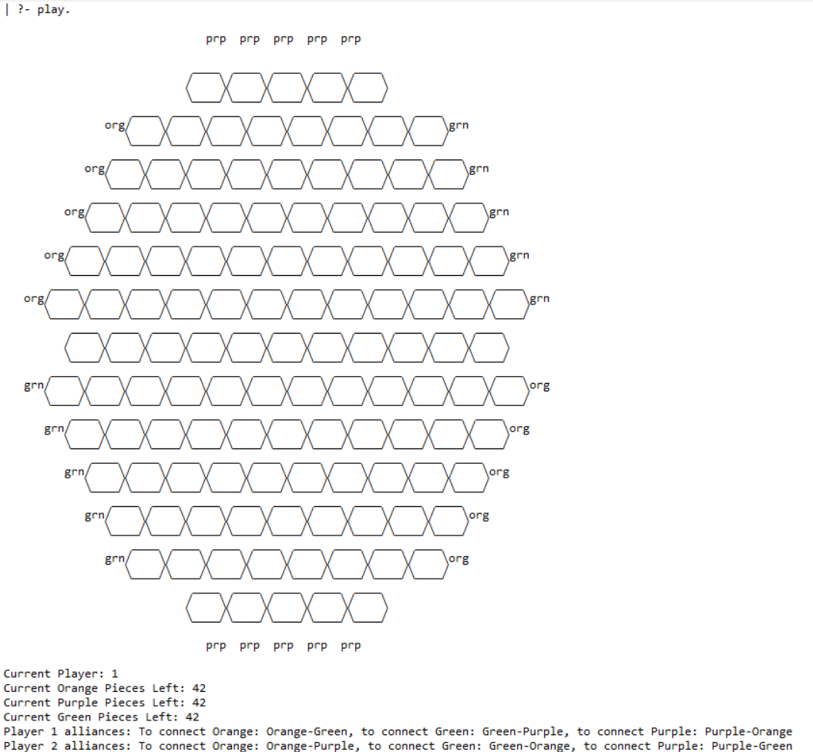
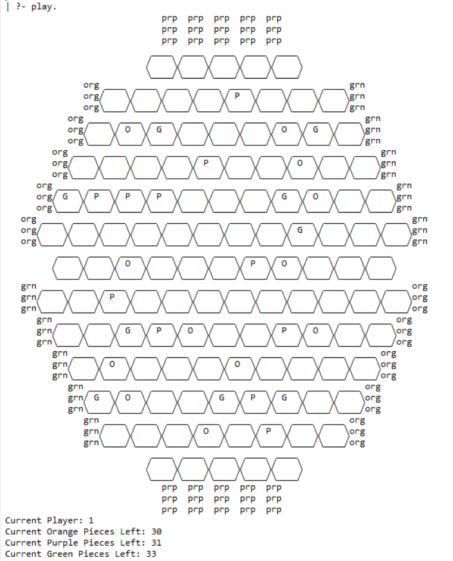
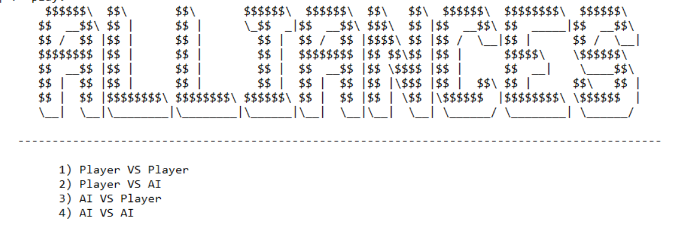
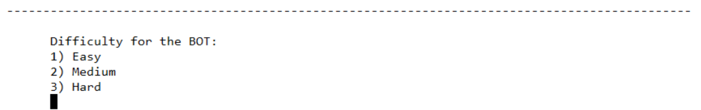

# Alliances-5

## Grupo Alliances_5 Turma 3
Diogo Guimarães do Rosário - 201806582  
Henrique Melo Ribeiro - 201806529

## Instação e execução
De modo a facilitar a utilização do programa foi criado um ficheiro "base" responsável por incluir todos os outros ficheiros. Assim, para correr o programa basta consultar o ficheiro alliances.pl.   
A fonte utilizada foi a "Consolas", de estilo "Regular" e tamanho 12.     
Depois de consultar o ficheiro basta correr o predicado principal play/0.

## Alliances
O objetivo final do jogo é ganhar 2 das 3 cores disponíveis.  
Para ganhar uma cor é necessário unir totalmente 1 cor de um lado ao outro do tabuleiro usando essa cor e a sua cor aliada ou então bloquear o adversário, isto é, usar a cor que nem é aliada nem a própria de modo a que seja impossível de fazer um caminho.     
Por exemplo, assumindo que o jogador 1 tem como aliada da cor laranja a cor verde e o jogador 2 tem como aliada da cor laranja a cor roxa. Para o jogador 1 ganhar a cor laranja, pode fazer um caminho ininterrupto de peças laranja e/ou verdes, ou então "cortar" o tabuleiro com a cor verde, o que faria com que o jogador 2 nunca conseguisse unir as 2 bordas do tabuleiro, visto que a cor roxa não é nem laranja, nem aliada da laranja para si.   
As cores aliadas são definidas no início do jogo e variam entre os jogadores.     
Existem 42 peças de cada cor (laranja, verde e roxo) que são partilhadas entre os 2 jogadores.    
As jogadas são intercaladas entre os jogadores e consistem em colocar uma peça de qualquer cor em qualquer casa vazia.  
As regras do jogo podem ser encontradas com mais detalhe no seguinte [link.](https://nestorgames.com/rulebooks/ALLIANCES_EN.pdf)
A página do jogo pode ser encontrada [aqui.](https://nestorgames.com/#alliances_detail)

## Lógica do Jogo

### Representação interna do jogo
É usada uma lista de listas para guardar o estado do jogo. As listas internas têm diferentes tamanhos, de modo a representar o número de hexágonos em cada linha. Foi usado um sistema de coordenadas de 2 eixos, um vertical e um diagonal, ambos começando no valor 0. <br />
### Estado inicial
 <br />
O jogador atual e o número de peças restantes de cada cor são representados no fundo do board, bem como as alianças para as cores de cada jogador.
As casas vazias são representados pelo valor empty, enquanto que as peças são representadas por 1 dos 3 seguintes valores - orange, green, purple. 
```prolog
cell_val(orange, 'O').
cell_val(green, 'G').
cell_val(purple, 'P').
cell_val(empty, ' ').
```
Para a visualização do jogo foram criados os seguintes predicados
```prolog
display_game([Board , Colors, NPieces | _],Player):-
    nl,
    close_hex_top,
    display_board(Board,Player,0),
    close_hex_bot,
    nl,
    display_player(Player),
    display_remaining_pieces(NPieces),
    display_colors(Colors),
    display_alliances.

display_board([],_,_).
display_board(GameState,Player,NRow) :-
    [H | T] = GameState,
    display_line(H,NRow),
    NewRow is NRow+1,
    display_board(T,Player,NewRow).

display_line(H,NRow) :-
    length(H,L),
    write_row_spaces(NRow,L),
    display_piece(H,NRow,0), 
    end_value(NRow,Line),
    write(Line),
    write('   '), write(NRow), nl.
```
Outros predicados auxiliares podem ser encontrados no seguinte [ficheiro](./display.pl) como, por exemplo, display_player que dá display ao próximo jogador a jogar.
O predicado display_game dá display ao board, bem como a primeira e última linha (close_hex_top e close_hex_bot respetivamente) visto que o display destas linhas é diferente das restantes. O resto das linhas é realizado dentro da função display board que é chamada recursivamente e dá display linha a linha do hexágono.
Para além disso display_game é responsável por dar display às cores já ganhas bem como o número de peças restantes e as alianças de cada jogador. 

### Estado intermédio
 <br />

### Estado final
 <br/>

### Menus 
#### Main Menu 
<br/>

 <br/>

Neste menu o jogador consegue selecionar o modo de jogo pretendido de entre um total de quatro modos de jogo:
- Jogador contra jogador.
- Jogador contra inteligência artificial.
- Inteligência artificial contra jogador.
- Inteligência artificial contra inteligência artificial.

No modo jogador contra jogador, todas as jogadas têm que ser introduzidas pelos utilizadores, sendo que cada jogador introduz uma jogada à vez.    
O jogo é iniciado imediatamente após a seleção deste modo de jogo.

Caso qualquer outro modo de jogo seja selecionado, um menu adicional será mostrado pedindo ao utilizador para escolher o nivel da inteligência artificial. Existem as seguintes dificuldades: fácil, média e difícil.

 <br/>

Quando um dos jogadores é controlado pela inteligência artificial, o computador irá fazer a sua jogada automaticamente.
<br/>
Os niveis de dificuldade causam comportamentos diferentes na forma como estes processam o tabuleiro atual:
- Fácil: neste nivel não existe processamento nenhum, apenas é escolhida uma jogada válida aleatória.
- Médio: a inteligência artificial tem um comportamento greedy em que analisa apenas os seus caminhos não tendo em conta o estado do jogo para o seu adversário. O AI irá sempre valorizar minimizar a distância dos seus caminhos.
- Difícil: igual à dificuldade média, mas nesta dificuldade a inteligência artificial tem em conta o estado do jogo para o adversário, tentando dificultar-lhe as próximas jogadas.

### Lista de jogadas válidas
A lista de jogadas válidas é obtida através do seguinte predicado.
```prolog
iterateRow([],_,_,_,NewListOfMoves,NewListOfMoves).
iterateRow([Value | T ],CurrentRow,CurrentDiagonal,NPieces,ListOfMoves,FinalListOfMoves):-
    get_possible_valid_move(Value,AuxOrange,AuxGreen,AuxPurple,CurrentRow,CurrentDiagonal,NPieces),
    append([AuxPurple],[AuxOrange],AuxList),
    append(AuxList,[AuxGreen],NewAuxList),
    append(ListOfMoves,NewAuxList,NewListOfMoves),
    NewDiagonal is CurrentDiagonal +1,
    iterateRow(T,CurrentRow,NewDiagonal,NPieces,NewListOfMoves,FinalListOfMoves).

iterateBoard([],_,_,FinalListOfMoves,FinalListOfMoves).
iterateBoard([Row | T ],NPieces,CurrentRow,ListOfMoves,FinalListOfMoves):- 
    diagonal_index(CurrentRow,Diagonal),
    iterateRow(Row,CurrentRow,Diagonal,NPieces,ListOfMoves,RowListOfMoves),
    NewRow is CurrentRow+1,
    iterateBoard(T,NPieces,NewRow,RowListOfMoves,FinalListOfMoves).

valid_moves([Board, _ , NPieces], _Player ,FinalListOfMoves):-
    iterateBoard(Board,NPieces,0,_ , AuxFinalListOfMoves),
    remove_dups(AuxFinalListOfMoves, NoDuplicateListOfMoves),
    delete(NoDuplicateListOfMoves,[], FinalListOfMoves).
```
Estas jogadas são obtidas de forma recursiva, iterando pelo tabuleiro. Quando o valor da casa é empty, são adicionadas as 3 jogadas possíveis, a não ser que o número de peças de uma cor seja 0.

### Execução de jogadas
O predicado de execução de jogadas é o predicado move/3.
```prolog
move([Board | T ], Move, NewGameState):-
    [RowNumber|_] = Move,
    getRow(Board,RowNumber,NewBoard,Move),
    NewGameState = [NewBoard|T].
```
Este predicado recebe o move depois de validado pelos inputs e retorna o novo estado do jogo.

Os inputs são feitos nos seguintes predicados

```prolog
getColor(Orange,_,_,'O',Orange).
getColor(_,Purple,_,'P',Purple).
getColor(_,_,Green,'G',Green).

valid_color(Color,[Orange, Purple, Green | _ ]):-
    atom(Color),
    getColor(Orange,Purple,Green,Color,FinalColor),
    writePiecesLeft(Color,FinalColor).

get_line(Line):-
    repeat,
        write('Insert move line (0-22): '),
        catch(read(Line),_,true),
        valid_line(Line),!.

get_diagonal(Diagonal, Line):-
    diagonal_index(Line, D1),
    diagonal_index_end(Line, D2),
    repeat,
        write('Insert move diagonal ('), write(D1), write('-'), write(D2), write(') :'),
        catch(read(Diagonal),_,true),
        valid_diagonal(Diagonal,D1,D2),!.

get_color(Color,NPieces):-
    skip_line,
    repeat,
        write('Insert move color (O, P, G): '),
        catch(get_char(Aux),_,true),
        skip_line,
        valid_color(Aux,NPieces),
        parse_color(Aux,Color),
        !.

errorMessage(empty).
errorMessage(_):-
  write('Invalid move, tile is not empty.'), nl,
  fail.

is_empty(Line,Diagonal,Board):-
    nth0(Line,Board,Row),
    diagonal_index(Line,X),
    Diagonal_index_in_row is Diagonal - X,
    nth0(Diagonal_index_in_row,Row,Elem),
    errorMessage(Elem).

get_move([Line,Diagonal,Color],Board, NPieces):-
    repeat,
        get_line(Line), 
        get_diagonal(Diagonal, Line),
        is_empty(Line,Diagonal,Board),!, 
    get_color(Color,NPieces).
```

### Final do jogo
O predicado game_over/2 é responsável por verificar o número de cores ganhas por cada jogador, retornando o winner em caso de vitória.

```prolog
count_occurrences(List, X, Count) :- aggregate_all(count, member(X, List), Count).

game_over([ _ , ColorsWon | _ ], Winner):-
    count_occurrences(ColorsWon,0,CountOfZero),
    count_occurrences(ColorsWon,1,CountOfOne),
    (CountOfZero < 2 ; Winner is 0),
    (CountOfOne < 2 ; Winner is 1).
```
Para verificar as cores ganhas é usado o predicado updateColorsWon seguinte
```prolog
updateColorsWon([Board, [OrangeWon, PurpleWon, GreenWon | _ ] | _ ],NewColorsWon, Player, 0, Length1, Length2):-
    NewP is mod(Player+1,2),

    checkOrange(OrangeWon,Player,Board,NewOrangeWon,Orange1Length),
    checkPurple(PurpleWon,Player,Board,NewPurpleWon,Purple1Length),
    checkGreen(GreenWon,Player,Board,NewGreenWon,Green1Length),
    Length1 = [Orange1Length,Purple1Length,Green1Length],

    checkOrange(NewOrangeWon,NewP,Board,FinalOrangeWon,Orange2Length),
    checkPurple(NewPurpleWon,NewP,Board,FinalPurpleWon,Purple2Length),
    checkGreen(NewGreenWon,NewP,Board,FinalGreenWon,Green2Length),
    Length2 = [Orange2Length,Purple2Length,Green2Length],

    NewColorsWon = [FinalOrangeWon,FinalPurpleWon,FinalGreenWon].

updateColorsWon([Board, [OrangeWon, PurpleWon, GreenWon | _ ] | _ ],NewColorsWon, Player, 1, Length1, Length2):-

    checkOrange(OrangeWon,Player,Board,NewOrangeWon,Orange1Length),
    checkPurple(PurpleWon,Player,Board,NewPurpleWon,Purple1Length),
    checkGreen(GreenWon,Player,Board,NewGreenWon,Green1Length),
    Length1 = [Orange1Length,Purple1Length,Green1Length],
    Length2 = [0,0,0],

    NewColorsWon = [NewOrangeWon,NewPurpleWon,NewGreenWon].
```
Este predicado é responsável por verificar o tamanho dos caminhos da cor laranja para ambos os players caso o predicado contenha o 0 a seguir ao player.
No caso em que este valor é 1, a função apenas calcula os caminhos do player atual. Esta implementação específica foi necessário para reduzir o tempo ao bot greedy médio, que utiliza esta função para calcular o tamanho dos seus caminhos aquando da simulação dos movimentos válidos.    
Este predicado serve-se das funções checkOrange, checkGreen e checkPurple para o cálculo do tamanho dos caminhos.
```prolog
checkOrange(0,_,_,0,_).
checkOrange(1,_,_,1,_).
checkOrange(_,Player,Board,NewOrangeWon,Orange1Length):-
    getOrangePathLength(Player,Board,Orange1Length),
    getNewWon(Player,Orange1Length,NewOrangeWon).

checkPurple(0,_,_,0,_).
checkPurple(1,_,_,1,_).
checkPurple(_,Player,Board,NewPurpleWon,Purple1Length):-
    getPurplePathLength(Player,Board,Purple1Length),
    getNewWon(Player,Purple1Length,NewPurpleWon).


checkGreen(0,_,_,0,_).
checkGreen(1,_,_,1,_).
checkGreen(_,Player,Board,NewGreenWon,Green1Length):-
    getGreenPathLength(Player,Board,Green1Length),
    getNewWon(Player,Green1Length,NewGreenWon).
```
Os casos iniciais de cada função servem para retornar o jogador que já ganhou a cor. Caso ninguém tenha ganho, o valor inicial será -1 e assim serão calculados os caminhos.
```prolog
getOrangePathLength(Player,Board,Length):-
    ToVisit = [[0,0],[1,0],[2,0],[3,0],[4,0]],
    allied(Player,orange,Allied),
    getPathLength(Board,ToVisit,[],Allied,orange,0,Length).


getPurplePathLength(Player,Board,Length):-
    ToVisit = [[18,7],[19,8],[20,9],[21,10],[22,11]],
    allied(Player,purple,Allied),
    getPathLength(Board,ToVisit,[],Allied,purple,0,Length).

getGreenPathLength(Player,Board,Length):-
    ToVisit = [[7,1],[9,2],[11,3],[13,4],[15,5]],
    allied(Player,green,Allied),
    getPathLength(Board,ToVisit,[],Allied,green,0,Length).
```
A lista ToVisit começa numa das bordas da cor e segue em direção à outra borda.
O tamanho é calculado na função getPathLength.
```prolog
getPathLength(_,[],_,_,_,_,-1).
getPathLength(Board,ToVisit,LastVisited,Allied,CheckingColor,CurrentDepth,Depth):-
    buildLevel(Board,[],ReturnLevel,ToVisit,LastVisited,Visited,Allied,CheckingColor,CurrentDepth), 
    getNextPossibleVisited(ReturnLevel, [],ToVisitNext),
    fillFinishLevel(Board,ToVisitNext,Visited,[],NewLevel,CheckingColor,Allied),
    append(ReturnLevel,NewLevel,FinishedLevel),
    append(Visited,NewLevel,NewVisited),
    getNextPossibleVisited(NewLevel,[],NewToVisitNext),
    append(NewToVisitNext,ToVisitNext,Aux),
    remove_list(Aux,NewVisited,NextListOfTiles),
    (
        (
            \+stopCondition(CheckingColor,FinishedLevel),
            getNextPathLength(Board,NextListOfTiles,ToVisit,NewVisited,Allied,CheckingColor,Depth,CurrentDepth)
        );
        (
            !,Depth is CurrentDepth
        )
    ).

getNextPathLength(Board,_,ToVisit,_,Allied,CheckingColor,Depth,0):-
    getPathLength(Board,ToVisit,[],Allied,CheckingColor,1,Depth).

getNextPathLength(Board,NextListOfTiles,_,NewVisited,Allied,CheckingColor,Depth,CurrentDepth):-
    CurrentDepth > 0,
    NewDepth is CurrentDepth+1,
    getPathLength(Board,NextListOfTiles,NewVisited,Allied,CheckingColor,NewDepth,Depth).
``` 
Este predicado é a função mais complexa do nosso projeto. O predicado irá construir níveis de casas que estarão todas à mesma distância da outra borda na função buildLevel. Caso alguma das bordas esteja presente no nível é retornada esse tamanho, uma vez que será sp o tamanho mínimo. Caso contrário é criado o nível seguinte e repetido o processo. <br/>
Em baixo um esboço para melhor ilustrar este processo.
 <br/>
Black -> Level 0 <br/>
Grey -> Level 1 <br/>
Red -> Level 2<br/>
Yellow -> Level 3<br/>
Purple -> Level 4<br/>
Green -> Level 5<br/>
Blue -> Level 6<br/>
Caso o tamanho do caminho seja 0, significa que a cor foi ganha pelo player que jogou em último.
Caso seja -1, significa que o player atual tem a cor bloqueada pelo adversário e, por esse motivo, a perdeu.
Caso contrário, o jogo prossegue e a cor continua em disputa.

### Avaliação do tabuleiro
A avaliação do tabuleiro é realizada no predicado value/2.
```prolog
value([_, ColorsWon, BotDiff,Length1,Length2 | _], Player, Value):-
    captured_color_value(Player, ColorsWon, ColorValue),
    getPathValue(ColorsWon,BotDiff,Length1,Length2,PathValue),
    Value is ColorValue + PathValue.

captured_color_value(Player, ColorsWon,ColorValue):-
    count_occurrences(ColorsWon,Player,CountOfPlayer),
    NewP is mod(Player+1,2),
    count_occurrences(ColorsWon,NewP,CountOfOpponent),
    AuxValue is 0 + CountOfPlayer * 400,
    ColorValue is AuxValue - (CountOfOpponent * 400).

get_Value(0,_,0).
get_Value(1,_,0).
get_Value(_,Length,Value):-
    Value is (9-Length)*(9-Length)*(9-Length).

getPathValue([Orange,Purple,Green], 3, [Length,Length1,Length2], [OppLength,OppLength1,OppLength2],PathValue):-
    get_Value(Orange,Length,PlayerValue),
    get_Value(Purple,Length1,PlayerValue1),
    get_Value(Green,Length2,PlayerValue2),
    get_Value(Orange,OppLength,OppValue),
    get_Value(Purple,OppLength1,OppValue1),
    get_Value(Green,OppLength2,OppValue2),
    PathValue is PlayerValue + PlayerValue1 + PlayerValue2 - OppValue - OppValue1 - OppValue2.

getPathValue([Orange,Purple,Green], 2, [Length,Length1,Length2], _ ,PathValue):-
    get_Value(Orange,Length,PlayerValue),
    get_Value(Purple,Length1,PlayerValue1),
    get_Value(Green,Length2,PlayerValue2),
    PathValue is PlayerValue + PlayerValue1 + PlayerValue2.
```
Este predicado aproveita-se do tamanho dos caminhos calculados anteriormente. Optamos por atribuir 400 pontos a cada cor ganha e -400 por cada cor perdida, somando a estes valores a constante 9 - o tamanho do caminho mais curto de cada cor, sendo esta subtração elevada a 3 para valorizar cada vez mais distâncias mais curtas. No caso do nível hard de dificuldade é também subtraído o valor final dos caminhos do adversário que está sujeito às mesmas operações aritméticas.

### Jogada do computador
A jogada do computador é feita no predicado choose_move/4.
```prolog
% Used to get a random move for the bot in the random dificulty.
choose_move(GameState,Player,1,Move):- 
    valid_moves(GameState,Player, ListOfMoves),
    length(ListOfMoves,Length),
    random(0,Length,RandomMove),
    nth0(RandomMove,ListOfMoves,Move), sleep(1),
    [Row,Diagonal,Color] = Move,
    write('Putting piece of color '), write(Color), write(' at row '), write(Row), write(' and diagonal '), write(Diagonal), nl.

choose_move(GameState,Player,BotDiff,Move):- 
    valid_moves(GameState,Player, ListOfMoves),
    simMoves(GameState,ListOfMoves,Player,BotDiff,_BestMove,-10000, NewMove),
    length(NewMove,Length),
    random(0,Length,RandomMove),
    nth0(RandomMove,NewMove,Move),
    [Row,Diagonal,Color] = Move,
    write('Putting piece of color '), write(Color), write(' at row '), write(Row), write(' and diagonal '), write(Diagonal), nl.

simMoves(_,[],_,_, BestMove,_, BestMove).
simMoves(GameState,[Move | T], Player, 2, BestMove,BestMoveValue, FinalBestMove):-
    [_, ColorsWon, NPieces] = GameState,
    updateNPieces(Move,NPieces,_),
    move(GameState, Move, [NewBoard | _]),  
    updateColorsWon([NewBoard, ColorsWon],NewColorsWon, Player, 1, Length1, Length2),
    value([NewBoard,NewColorsWon, 2,Length1,Length2], Player, Value),
    canImprove(Value,BestMoveValue,GameState,T,Player,2,Move,BestMove,FinalBestMove).

simMoves(GameState,[Move | T], Player, 3, BestMove,BestMoveValue, FinalBestMove):-
    [_, ColorsWon, NPieces] = GameState,
    updateNPieces(Move,NPieces,_),
    move(GameState, Move, [NewBoard | _]),  
    updateColorsWon([NewBoard, ColorsWon],NewColorsWon, Player,0 , Length1, Length2),
    value([NewBoard,NewColorsWon,3,Length1,Length2], Player, Value),
    canImprove(Value,BestMoveValue,GameState,T,Player,3,Move,BestMove,FinalBestMove).

    
canImprove(Value,BestMoveValue,GameState,T,Player,BotDiff,Move,_,FinalBestMove):-
    Value > BestMoveValue,
    simMoves(GameState,T,Player,BotDiff,[Move],Value,FinalBestMove).

canImprove(Value,Value,GameState,T,Player,BotDiff,Move,BestMove,FinalBestMove):-
    simMoves(GameState,T,Player,BotDiff,[Move | BestMove],Value,FinalBestMove).

canImprove(_,BestMoveValue,GameState,T,Player,BotDiff,_,BestMove,FinalBestMove):-
    simMoves(GameState,T,Player,BotDiff,BestMove,BestMoveValue,FinalBestMove).
```
O objetivo deste predicado é simular todos as jogadas disponíveis, avaliando o tabuleiro no final de cada, guardando o maior valor e as maiores jogadas. No final de cada move simulado é chamado canImprove, que verifica se o move avaliado é superior ao melhor move no momento.

## Conclusões
Em suma, no final deste projeto consideramos que ficamos mais familiarizados com a linguagem prolog e com programação lógica em geral.  <br/>
Consideramos também que conseguimos criar um programa que se assemelha ao jogo "Alliances" de forma completa e robusta, capaz de ser posteriormente adaptado por interfaces gráficas de forma a criar uma experiência mais completa ao utilizador. <br/>
Uma das limitações do nosso projeto é a impossibilidade de desfazer uma jogada após a realizar. Para além disso, devido ao tabuleiro de forma hexagonal, não é possivel utilizar o sistema de coordenadas tradicional sendo que foi preciso criar um que se adapta ao nosso tabuleiro, sendo que o que foi criado é um pouco confuso de utilizar no início.  <br/>
Uma forma de melhorar o trabalho seria tentar optimizar a função de avaliação do tabuleiro para se assemelhar a um algoritmo minimax de forma a diminuir o tempo de processamento.<br/>

## Bibliografia
